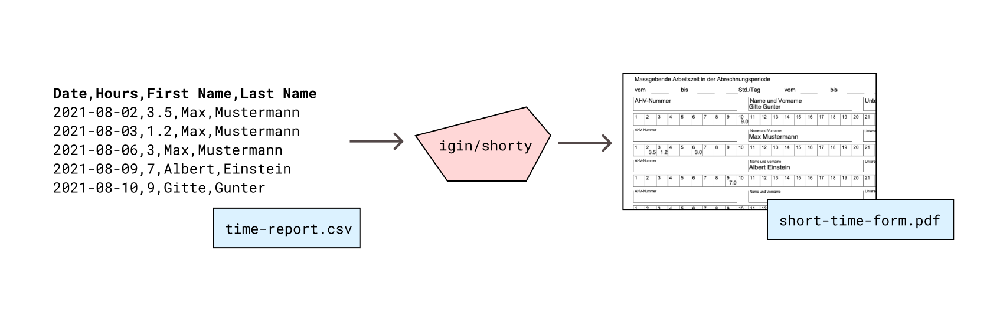

# Shorty - Automatically fill the Swiss short time form from a time tracking sheet

The Swiss authorities want companies on short-time to submit a PDF form with details
on the amount of short-time accumulated in the company. In the form you need to specify
the hours worked on short-time per employee per day of the month. This quickly becomes
a very time consuming and error prone manual task. 

This tool tries to solve this issue by automatically filling the PDF form from the export
of a time tracking tool.
